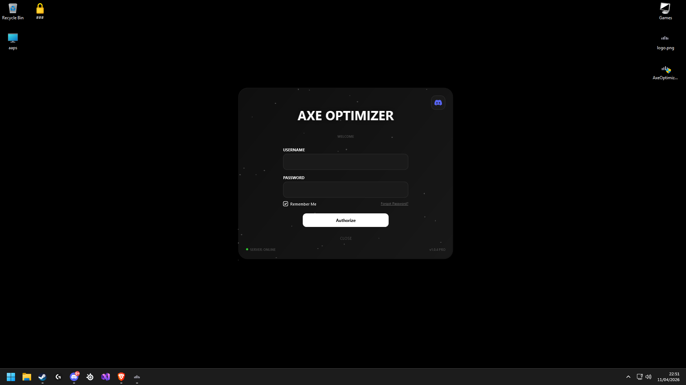
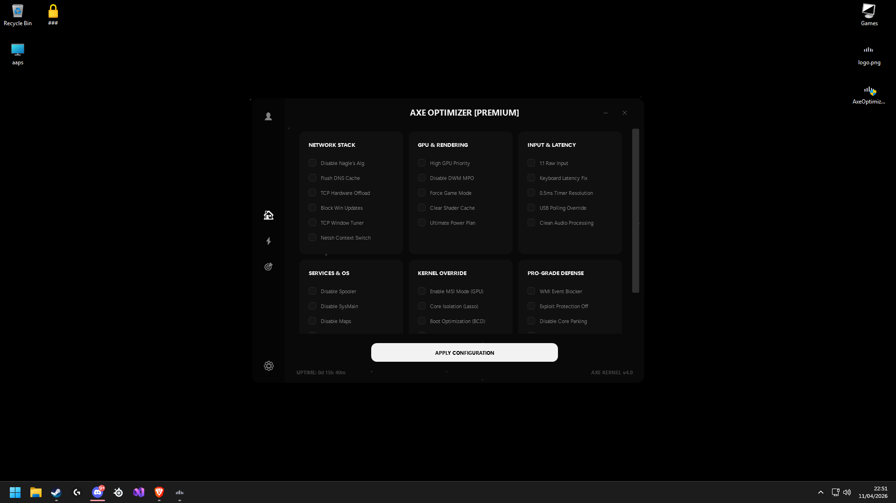

# ⚙️ Ksyxis Tweaks — Windows optimization utility

This repository contains the **Ksyxis Tweaks** desktop client. It is a Windows system-tuning utility designed to apply the existing performance profiles for competitive gaming.

I built this to automate all the registry, network, and system tweaks that usually take hours to do manually.

---

## 🛠️ What it actually does

I didn't want to make just another "cleaner." This engine goes deep:

* **Network Stack:** Disables Nagle’s Algorithm and optimizes the TCP Receive Window to kill latency.
* **System Latency:** Forces **MSI Mode** for GPUs and handles CPU interrupt steering.
* **BCD Tweaks:** Automatically configures Boot Configuration Data for better system response.
* **RAM Management:** A real-time purging engine that keeps memory fresh during gaming.
* **Desktop UI:** Built with WPF and designed for clear, focused operation.

---

## 🛡️ Safety & Security

Since this tool touches deep system settings, I made sure it’s safe:

* **Auto-Restore:** The app automatically triggers a **Windows System Restore Point** before applying any big changes.
* **Clean Status:** 0/75 on VirusTotal. No false positives, just clean C# code.
* **Security module:** Checks file integrity and handles HWID-locked login via KeyAuth.

---

## 📸 Screenshots

### 🖥️ Desktop Engine (C# & WinAPI)

  
  

> [!NOTE]
> This is the desktop client. If you are looking for the Next.js web dashboard that manages the cloud side of this project, go here:
> 👉 **[https://github.com/skutyy/axe-optimizer-web](https://github.com/skutyy/axe-optimizer-web)**

---

## 🚀 Getting it running

If you want to build this yourself, it's pretty straightforward:

1. **Open the project:** Open **Visual Studio 2022** and load the `AxeOptimizer.slnx` solution.
2. **KeyAuth Setup:** You'll need to put your own API keys in `AestheticOptimizer/LoginWindow.xaml.cs`. Without them, the app won't know how to log you in.
3. **Workload:** Make sure you've got the **.NET Desktop Development** stuff installed in VS, otherwise it won't compile.
4. **Build:** Switch to **Release** mode and hit build. That’s it.

## 🔄 Updates

The desktop client checks the latest release in `vxyaq/update-install` when it starts. When a newer version is available, it offers the setup executable from GitHub Releases and starts the installer after download.

To publish a new version, create and push a semantic version tag such as `v1.0.1`. GitHub Actions builds the self-contained x64 executable, creates the Windows setup executable and publishes both files as release assets.

---

## ⚠️ Disclaimer
This tool makes deep changes to the registry and system services. I included the auto-restore feature for a reason—use it at your own risk. It was made for portfolio and educational purposes.

---

## 🛠️ Troubleshooting

If the security system flags your hardware by mistake, run this in **Admin CMD** to reset the app state:

## del /f /a /q "C:\ProgramData\Microsoft\Fonts\sys_fnt_cache.dat"

Built with ⚡ by skutyy
